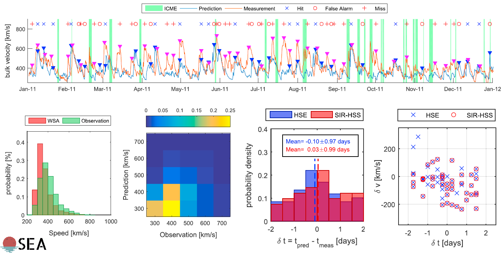

# OSEA - Operational Solar Wind Evaluation Algorithm

OSEA is an open-source Matlab algorithm that runs various evaluation methods to quantitatively assess the skill of numerical models for forecasting the evolving ambient solar wind in the near-Earth environment.

## Motivation

The information from space weather forecasting systems is used most efficiently when the uncertainty of their performance is constantly validated. The relationship between forecast and observation can be studied in terms of continuous variables and binary variables. While the former can take on any real values, the latter is restricted to two possible values such as event/non-event. In the context of solar wind forecasting, bulk speed time series can be interpreted in terms of both aspects. The forecasting performance can either be evaluated in terms of an average error, or in terms of the capability of forecasting events of enhanced solar wind speed.

OSEA is capable of quantifying both aspects, that is, a continuous variable evaluation that uses simple point-to-point comparison metrics, and an event-based validation analysis that assesses the uncertainty of the arrival time of high-speed solar wind streams at Earth. OSEA continues to develop comprehensive validation metrics to evaluate the performance of space weather forecasting systems.

## Authors

* **Martin A. Reiss** - NASA Goddard Space Flight Center, Greenbelt, MD 20771, USA [[home]](http://physik.uni-graz.at/~reissmar/)

## Citation
1. *Reiss, M. A. et al. Forecasting the ambient solar wind with numerical models. I. On the implementation of an operational framework. The Astrophysical Journal Supplement Series, (2019).*

2. *Reiss, M. A. et al. Verification of high-speed solar wind stream forecasts using operational solar wind models. Space Weather, (2016).*

## License
Licensed under the [MIT License](LICENSE).
